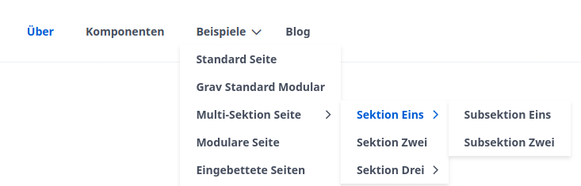

!!! This page contains an introduction to the Hadron Theme and describes the main features and options.

===

## Introduction
The Hadron Theme is a modern [Grav](https://getgrav.org) theme based on [Quark](https://github.com/getgrav/grav-theme-quark). As a child theme of Quark, it includes advanced features compared to the original Quark theme. It also offers advanced styling options.

## Hadron
Hadron comes in 2 variants: as a theme and as a skeleton. The skeleton includes the theme, as well as additional features and configurations. Learn more about the [Hadron Skeleton](/hadron/skeleton/introduction).

## Features
The Hadron Theme offers the following features:

### German language pack
The Hadron Theme includes a German language pack that translates the user interface and configurations into German. However, the English language is still available.

### Responsive tables
Tables can be automatically optimized for mobile devices. This means that tables are displayed differently on mobile devices to improve readability. Learn more about mobile-friendly tables at [grav.demo.crabston.dev/components](https://grav.demo.crabston.dev/komponenten#mobilfreundliche-tabellen).

### Navigation with drop-down menu
Navigation can be enhanced with a drop-down menu. This allows not only the main pages but also the subpages to be displayed in the navigation:

### Featured posts in blogs
Posts can be pinned to feature them. This is particularly useful for marking important posts or announcements.

### Built-in support for Embed.ly
Embed.ly is a service that allows embedding content from other websites. The Hadron Theme supports Embed.ly to embed content from other websites.

### Built-in support for H5P
H5P is a framework for creating interactive content. The Hadron Theme supports H5P to embed interactive content in Grav.

### Advanced theme options
The Hadron Theme offers advanced theme options to configure the appearance and behavior of the site.

### Other enhancements
The Hadron Theme includes other enhancements to improve the user experience and customize the theme to the users' needs.

## Next steps
To install the Hadron Theme, follow the guide [Hadron Theme Installation](/hadron/theme/installation).
